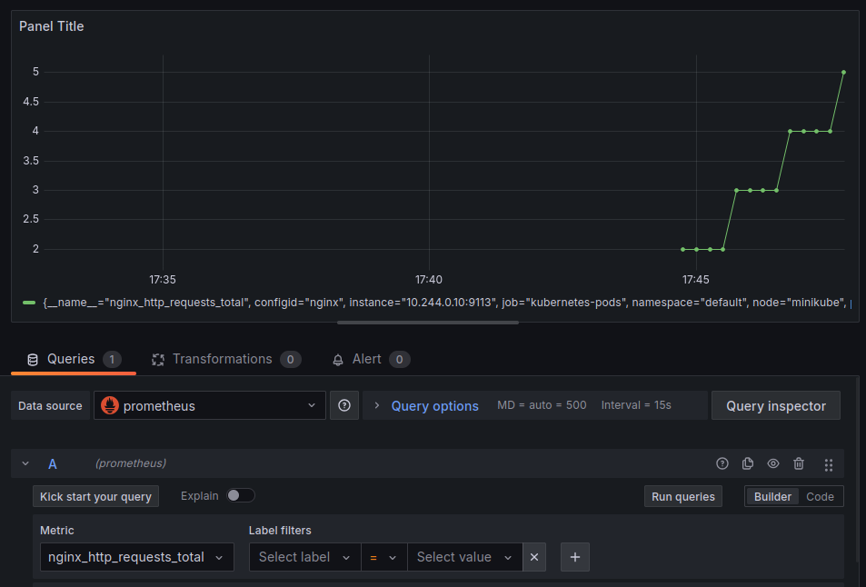
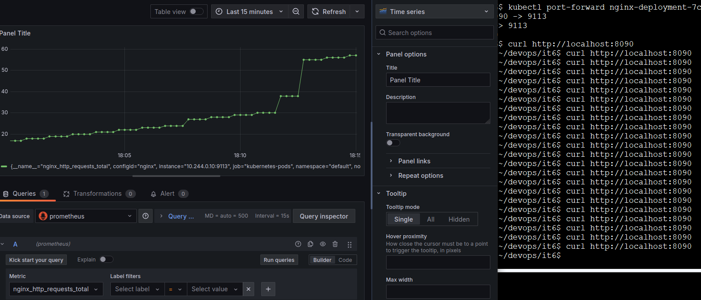

**Задание 6.**

**Мониторинг приложения** Nginx **в Minikube с использованием Prometheus и Grafana**

**Цель: Научиться настраивать мониторинг Kubernetes-кластера и приложений с использованием Prometheus и Grafana в среде Minikube.**

Описание задания:

- Запустите Minikube, если он еще не запущен.
- Установите Prometheus с использованием Helm.
- Установите Grafana с использованием Helm.
- Создайте простое приложение на основе Nginx.
- Убедитесь, что приложение работает, вызвав его через minikube service.
- Добавьте в Grafana источник данных.
- Сделайте метрику nginx\_http\_requests\_total.

В качестве решения необходимо сделать отчет, в котором видны обращения через port-forwarding, и это же количество видно в Grafana.

Результат задания — после выполнения задания у Вас будет развернутый в Minikube мониторинг с использованием Prometheus и Grafana. Вы сможете наблюдать за работой вашего приложения, настраивать сбор метрик и визуализировать их в Grafana.

**1. Запуск Minikube**

minikube start

minikube status

-----
**2. Установка Prometheus с использованием Helm**

helm repo add prometheus-community https://prometheus-community.github.io/helm-charts

helm repo update

Установка Prometheus:

helm install prometheus prometheus-community/prometheus --namespace monitoring --create-namespace

Проверка,

kubectl get pods -n monitoring

-----
**3. Установка Grafana с использованием Helm**

helm repo add grafana https://grafana.github.io/helm-charts

helm repo update

Установка Grafana:

helm install grafana grafana/grafana --namespace monitoring

Получим временный пароль для Grafana:

kubectl get secret --namespace monitoring grafana -o jsonpath="{.data.admin-password}" | base64 --decode ; echo

порт-форвардинг для доступа к интерфейсу Grafana:

kubectl port-forward --namespace monitoring svc/grafana 3000:80

В браузере http://localhost:3000, чтобы войти в Grafana.

-----
**4. Создание простого приложения на основе Nginx**

Конфигурация для nginx

###################### nginx-config.yaml #################

apiVersion: v1

kind: ConfigMap

metadata:

`  `name: nginx-config

data:

`  `nginx.conf: |-

`    `user  nginx;

`    `worker\_processes  10;

`    `error\_log /dev/stdout warn;

`    `pid       /var/run/nginx.pid;

`    `events {

`      `worker\_connections  10240;

`    `}

`    `http {

`        `include         /etc/nginx/mime.types;

`        `default\_type    application/octet-stream;

`        `server {

`            `listen       8080;

`            `server\_name  localhost;

`            `location /stub\_status {

`                `allow 127.0.0.1;

`                `deny all;

`                `stub\_status on;

`            `}

`            `location / {

`                `return 200 'NGINX is alive';

`            `}

`        `}

`    `}

##########################################################

манифест для деплоя Nginx:

###################### nginx-deployment.yaml #################

piVersion: apps/v1

kind: Deployment

metadata:

`  `name: nginx-deployment

spec:

`  `replicas: 1

`  `selector:

`    `matchLabels:

`      `configid: nginx

`  `template:

`    `metadata:

`      `labels:

`        `configid: nginx

`      `annotations:

`        `prometheus.io/scrape: "true"

`        `prometheus.io/path: "/metrics"

`        `prometheus.io/port: "9113"

`    `spec:

`      `containers:

`        `- name: nginx

`          `image: nginx

`          `volumeMounts:

`            `- name: nginx-config

`              `mountPath: /etc/nginx/nginx.conf

`              `subPath: nginx.conf

`        `- name: exporter

`          `image: nginx/nginx-prometheus-exporter:0.8.0

`          `args:

`            `- -nginx.scrape-uri=http://127.0.0.1:8080/stub\_status

`      `volumes:

`        `- name: nginx-config

`          `configMap:

`            `name: nginx-config

############################################################

Применяем манифест:

kubectl apply -f nginx-config.yaml

kubectl apply -f nginx-deployment.yaml 

-----
**5. Добавление источника данных в Grafana**

Войдите в Grafana и добавьте источник данных для Prometheus:

1. Перейдите в **Configuration > Data Sources**.
1. Нажмите **Add data source**.
1. Выберите **Prometheus**.
1. В поле **URL** укажите адрес Prometheus, например:

http://prometheus-server.monitoring.svc.cluster.local:80

1. Нажмите **Save & Test**.

-----
**7. Создание Dashboard в Grafana**

1. Перейдите в Grafana и создайте новый Dashboard.
1. Добавьте панель (Panel).
1. В настройках панели выберите метрику nginx\_http\_requests\_total.
1. Сохраните Dashboard.

-----
**8. Визуализация запросов через Port-Forwarding**

Создайте порт-форвардинг для Nginx:

kubectl port-forward nginx-deployment-7c8c69c47d-wxwb5 8090:8080 

Откройте в браузере:

http://localhost:8090

Проверьте количество запросов:

curl http://localhost:8090

Эти же метрики должны отображаться в Grafana.

-----
**Результат**

Подготовьте отчет с:

1. Скриншотом команд curl с количеством запросов.
1. Скриншотом Dashboard Grafana с графиком nginx\_http\_requests\_total.

